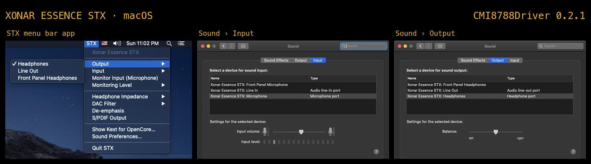

# CMI8788Driver



macOS (IOAudioFamily) kext for the Asus Xonar Essence STX / STX II, which are
built on the C-Media CMI8788 ("Oxygen HD") chip. It is a port of the Linux
`snd-virtuoso` driver; the Linux sources it follows are kept unmodified in
[`reference/linux-oxygen/`](reference/linux-oxygen/), and each function in
[`CMI8788Chip.cpp`](CMI8788Driver/CMI8788Chip.cpp) names the Linux function it
mirrors.

Target: Intel Macs / hackintoshes on macOS 10.15 Catalina and later, and OS X
10.9 Mavericks (a separate build of the kext). Developed on 10.15.7 and 10.9.5.

## Status

Working on hardware: plays and records on a Xonar Essence STX.

- Stereo playback through the PCM1792A at 44.1 / 48 / 88.2 / 96 / 176.4 / 192 kHz,
  24-bit samples
- Stereo line-in capture through the CS5381 at the same rates
- Input selection: Line In, Microphone, Front Panel Microphone (mic through the
  CM9780 preamp with +20 dB boost and a gain slider)
- Hardware input monitoring (line/mic in straight to the outputs, 0 or −6 dB),
  also exposed as CoreAudio's standard play-through controls; DAC filter
  roll-off (sharp/slow), de-emphasis
- S/PDIF output (coaxial/optical jack) mirroring the analog stereo at the
  playback rate, as Linux's "IEC958 Playback Switch". Off by default.
  **Untested with a receiver**: the register programming was checked against
  the Linux driver at 44.1 / 48 / 192 kHz, but nobody has listened to it yet
- STX menu bar app for the card settings, and an installer
- Volume (-60 to 0 dB in 0.5 dB steps, done in the DAC), mute
- Output selection: Headphones (rear jack), Line Out, Front Panel Headphones
- Headphone gain offset from the `HeadphoneImpedance` personality key (ohms),
  like the Linux "Headphones Impedance" control; without it, -18 dB (< 32 ohm)

- Sleep / wake (playback resumes after wake)

Not yet: a separate S/PDIF stream (Dolby/DTS passthrough), the H6
daughterboard's extra channels.

Tested on the dev box (Catalina 10.15.7, i7-3770, original STX `1043:835c`
behind a PEX8112): playback at 44.1-192 kHz, volume / mute / balance, switching
between Headphones and Line Out during playback, stereo line-in capture (clean
1 kHz tone, correct channels), sleep / wake with audio playing, a ModMic on the
mic input with hardware monitoring, the STX app and installer, and repeated
load / unload with the card present. On OS X 10.9.5 (same box): the 10.9 kext
loaded with `kextutil` and injected by OpenCore, playback, headphone impedance,
sleep / wake, and the STX app from the installer. Untested: front-panel jacks,
the STX II, macOS 10.10–10.14 and 11+, and the installer's kext component.
Loading through OpenCore injection is how the dev box runs it.

### Debugging

Set `Debug` to true in the kext personality (`IOKitPersonalities` in
`CMI8788Driver-Info.plist`) to have the engine publish capture/playback DMA
positions, the input buffer peak and the routing registers to the I/O registry
once a second:

```sh
ioreg -l -r -c CMI8788AudioEngine | grep Debug
```

Recording from a command-line tool over SSH returns silence on Catalina unless
the tool has microphone permission; test capture with a normal app (QuickTime,
Audacity) instead.

## Installing

Requirements: an Intel Mac or hackintosh with a Xonar Essence STX or STX II
(PCIe; the plain Essence ST is PCI and isn't supported), with the card's
auxiliary power connector plugged in. Requires macOS 10.15 Catalina or later
(`CMI8788Driver.kext`), or OS X 10.9 Mavericks (`CMI8788Driver-10.9.kext`).
Download `CMI8788Driver-<version>.pkg`
(installer) or `.zip` from the releases page. Neither is signed: right-click the
installer and choose Open.

> **Other macOS versions:** 10.10–10.14 are untested; the 10.9 kext will
> plausibly load there. Snow Leopard–era systems (e.g. 2006–2012 Mac Pros on
> 10.6–10.8) would need an i386 kernel slice and an older toolchain. Not
> planned, but contributions welcome.

The installer has two parts (Customize to choose):

- **STX menu bar app and tools**: `STX.app` (starts at login), `stxctl`, and
  copies of both kexts plus `uninstall.sh` in `/Library/Application Support/CMI8788Driver/`.
- **Driver (kext) in /Library/Extensions**: the SIP-off route below, with the
  kext built for the macOS it runs on. OpenCore users untick this and inject
  the kext instead.

To uninstall: `sudo sh "/Library/Application Support/CMI8788Driver/uninstall.sh"`.

The kext is not signed, so macOS's kext signing check has to be out of the way
one of these two ways.

### Hackintosh / OpenCore Legacy Patcher Macs: inject with OpenCore

1. Copy `CMI8788Driver.kext` to `EFI/OC/Kexts/` (with the installer, the STX
   menu's "Show Kext for OpenCore…" finds it).
2. Add an entry to `config.plist` under `Kernel` → `Add`:

   | Key | Type | Value |
   |---|---|---|
   | Arch | String | `x86_64` |
   | BundlePath | String | `CMI8788Driver.kext` |
   | Comment | String | `Xonar Essence STX` |
   | Enabled | Boolean | `true` |
   | ExecutablePath | String | `Contents/MacOS/CMI8788Driver` |
   | MaxKernel | String | (empty) |
   | MinKernel | String | (empty) |
   | PlistPath | String | `Contents/Info.plist` |

3. Run `ocvalidate`, reboot. SIP can stay enabled.

**On OS X 10.9**, use `CMI8788Driver-10.9.kext` (BundlePath
`CMI8788Driver-10.9.kext`, MaxKernel `13.99.99`). 10.9's kernel cache leaves
out IOAudioFamily, which the kext links against, so also add two
`Kernel` → `Force` entries, in this order, both with MaxKernel `13.99.99`:

| BundlePath | Identifier | ExecutablePath |
|---|---|---|
| `System/Library/Extensions/OSvKernDSPLib.kext` | `com.apple.kext.OSvKernDSPLib` | `Contents/MacOS/OSvKernDSPLib` |
| `System/Library/Extensions/IOAudioFamily.kext` | `com.apple.iokit.IOAudioFamily` | `Contents/MacOS/IOAudioFamily` |

(Arch `Any`, PlistPath `Contents/Info.plist`, Enabled `true`.) Without them
the OpenCore log shows "Dependency com.apple.iokit.IOAudioFamily was not found"
and the kext isn't loaded.

Card settings can go in the injected kext's `Info.plist` as boot defaults (see
Configuration), e.g. `HeadphoneImpedance`; the STX app overrides them after
login with whatever you chose last.

### Any Intel Mac: SIP off, load from /Library/Extensions

(OS X 10.9 has no SIP: skip step 1 and use `CMI8788Driver-10.9.kext`. OS X
says the kext is "not from an identified developer" and loads it anyway.)

1. Disable SIP's kext signing check from Recovery: `csrutil disable` (or
   `csrutil enable --without kext`). On a hackintosh, OpenCore's Toggle SIP
   entry works too.
2. Install and load:

   ```sh
   sudo cp -R CMI8788Driver.kext /Library/Extensions/
   sudo chown -R root:wheel /Library/Extensions/CMI8788Driver.kext
   sudo chmod -R 755 /Library/Extensions/CMI8788Driver.kext
   sudo kextutil /Library/Extensions/CMI8788Driver.kext
   ```

   On Big Sur and later, macOS asks you to approve the extension in Security &
   Privacy and reboot.

"Xonar Essence STX" then shows up in Sound preferences. Uninstall with
`sudo kextunload -b com.lukesau.driver.CMI8788Driver` and deleting the kext.

## Configuration

Output (Headphones / Line Out / Front Panel Headphones) and input (Line In /
Microphone / Front Panel Microphone) are chosen in Sound preferences.

The card settings below have no place in Sound preferences. The easiest way to
set them is the **STX menu bar app**, which saves your choices and reapplies
them whenever the card appears (at login, after wake, after a driver reload).
Its Output and Input submenus mirror Sound preferences (and stay in sync with
it), and remember your choice across reloads and reboots. The Input submenu and
"Monitor Input" item sit together: monitoring plays
whichever input is selected, and the menu bar shows "STX ●" while it's on.
Changes made elsewhere (Sound preferences, `stxctl`, other apps) are saved as
your new choice too.
`stxctl` sets them from the command line, and the same keys in
`CMI8788Driver.kext/Contents/Info.plist` (under `IOKitPersonalities` →
`CMI8788Driver`) set boot-time defaults:

| Key | Type | Effect |
|---|---|---|
| `HeadphoneImpedance` | Number | Your headphones' impedance in ohms (the Linux "Headphones Impedance" / Windows "HP Amp Gain" setting). Picks the headphone gain offset like the Linux driver: < 32 Ω −18 dB, 32–63 Ω −12 dB, 64–299 Ω −6 dB, 300 Ω and up 0 dB. Without it: −18 dB, the safe default. |
| `OutputDestination` | String | `headphones`, `line` or `frontpanel`: the selected output, same as choosing it in Sound preferences (which stays in sync). |
| `InputSource` | String | `line`, `mic` or `frontmic`: the selected input, same as choosing it in Sound preferences (which stays in sync). |
| `InputMonitor` | String | `off`, `half` (−6 dB) or `full` (0 dB): play the line/mic input straight to the outputs, in hardware. Also available to other apps as CoreAudio play-through (`kAudioDevicePropertyPlayThru`). |
| `InputMonitorLevel` | String | `half` or `full`: the level monitoring uses when switched on; kept while it's off. |
| `DACFilter` | String | `sharp` (default) or `slow`: the PCM1792A's digital filter roll-off. |
| `Deemphasis` | Boolean | De-emphasis for old pre-emphasized recordings. Default off. |
| `SPDIFOutput` | Boolean | Send the same stereo as the analog outputs to the S/PDIF jack. Default off. Untested with a receiver. |
| `Debug` | Boolean | Publish diagnostics to the I/O registry (see Debugging). Info.plist only. |

`stxctl` (installed by the installer, or in the zip; not part of the kext)
changes them immediately (the STX app, if running, then saves them):

```sh
stxctl status
stxctl impedance 300
stxctl output headphones|line|frontpanel
stxctl input line|mic|frontmic
stxctl monitor off|half|full
stxctl filter sharp|slow
stxctl deemphasis on|off
stxctl spdif on|off
```

## Apple Silicon

Not supported, and not realistically possible, even with the card in a
Thunderbolt PCIe enclosure:

- The CMI8788 exposes its registers only through an I/O-port BAR (Linux uses
  `inb`/`outb`; there is no memory-mapped alternative). Thunderbolt-attached
  devices generally don't get PCI I/O space, ARM has no port I/O, and Apple
  Silicon's PCIe isn't known to provide it, so the registers would be
  unreachable.
- Kexts on Apple Silicon need Reduced Security and an arm64 build; the
  supported route is a DriverKit driver (PCIDriverKit + AudioDriverKit), whose
  register access is built around memory BARs, so it hits the same wall.

The chip knowledge in `CMI8788Chip.cpp` would carry over to any future
attempt; the IOAudioFamily code would not. This driver targets Intel Macs and
hackintoshes, which are supported up to macOS 26 Tahoe.

## Layout

| File | Role |
|---|---|
| `CMI8788Driver/OxygenRegs.h` | Register map, generated from the Linux headers |
| `CMI8788Driver/CMI8788Chip.*` | Hardware layer: register/I2C/AC'97 access, chip and STX init, rates, DMA, interrupts |
| `CMI8788Driver/CMI8788AudioEngine.*` | IOAudioEngine: DMA buffers, timestamps, format changes, sample conversion |
| `CMI8788Driver/CMI8788AudioDevice.*` | IOAudioDevice: matching, bring-up, controls, card settings, sleep/wake |
| `app/STX/` | STX menu bar app (Objective-C/AppKit; one binary for 10.9 and later) |
| `tools/stxctl.c` | Command-line settings tool |
| `installer/` | Installer package: distribution, scripts, LaunchAgent, uninstaller |
| `scripts/make-banner.sh` | Rebuilds `docs/banner.png` from `docs/screenshots/` (ImageMagick) |

## Building

Needs Command Line Tools (no Xcode project), plus two old SDKs: 10.15 (Command
Line Tools 12.4) for the 10.15+ kext, and 10.9 (from Xcode 6.1.1 on
developer.apple.com) for the 10.9 kext, the STX app and `stxctl`. Point `SDK`
and `SDK_10_9` at them if they aren't found.

```sh
make            # both kexts (build/, build/10.9/), STX.app, stxctl
make remote     # rsync to the dev box (ssh host "hackintosh") and build there
make load       # on the box: copy to /tmp, chown root:wheel, kextutil (SIP must be off)
make unload
make pkg        # installer in dist/
make dist       # release zip and installer in dist/ (version from the Makefile)
```

## License

GPL-2.0-only (see [`COPYING`](COPYING)), because the driver is derived from the
Linux snd-oxygen code by Clemens Ladisch.
